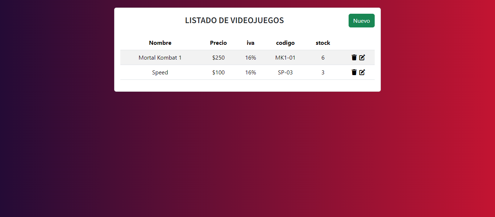
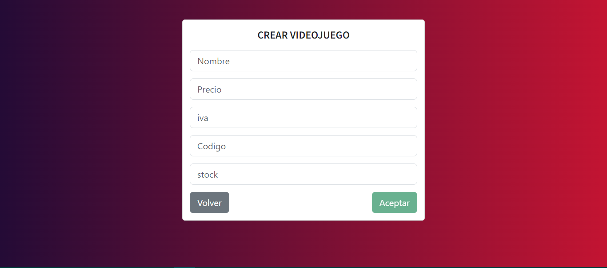
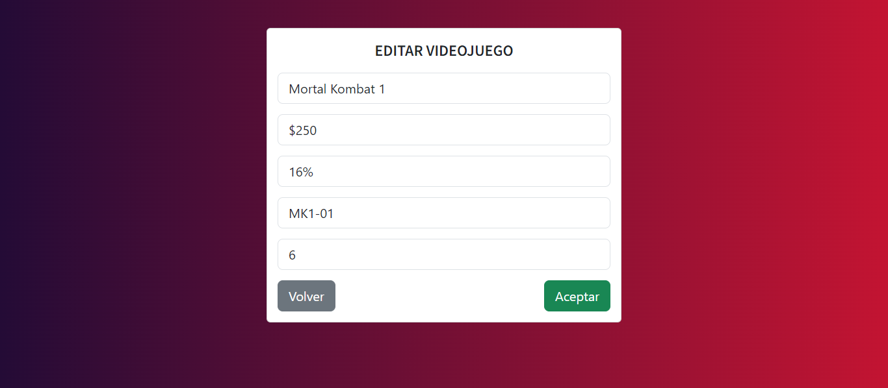
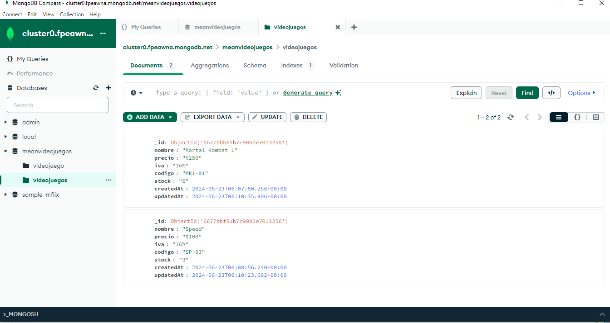

# CRUD Angular, Node.js, Express, MongoDB
A continuación, se presenta una previsualización del sistema CRUD desarrollado con Angular para el frontend, y Node.js, 
Express y MongoDB para el backend. 

